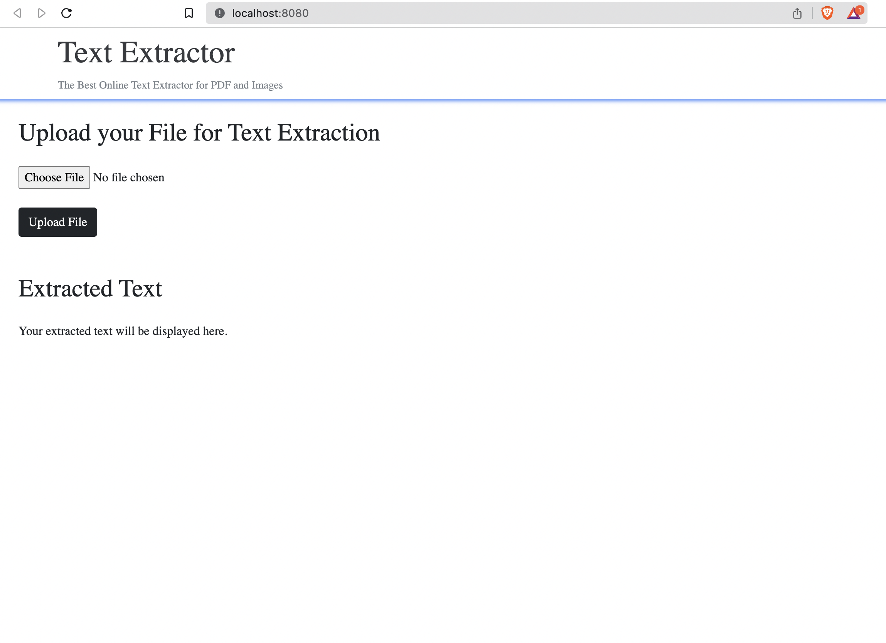

# Extrating Text From Images and PDFs

## Description
This project is a small web application developed with Django that allows users to upload text or PDF files to extract the text from them. The extracted text is displayed on the user interface for visualization.
The project utilizes additional dependencies such as Tesseract for image manipulation and PDF file handling, enabling precise and efficient extraction of content from the uploaded documents.

## Installation
1. Clone this repository on your local machine using the following command:
```bash
git clone https://github.com/JassielMG/Extrac-Text-Using-Tesseract-App.git 
```
2. Navigate to the project directory:
```bash
cd Extrac-Text-Using-Tesseract-App
```
3. Create a virtual environment, activate it, and install the dependencies:
```bash
python -m venv venv
```
```bash
source venv/bin/activate (or venv\Scripts\activate.bat for Windows)
```
4. Install the project dependencies:
```bash
pip install -r requirements.txt
```

## Usage
1. Run the Django server:
```bash
python manage.py runserver 0.0.0.0:8080
```
2. Open your browser and go to the following URL:
```bash
http://localhost:8080/
```
3. On the home page, you can upload a text or PDF file by clicking the "Choose File" button. Once the file is uploaded, click the "Upload File" button.


4. The extracted text from the file will be displayed on the same page.



## Contact

If you have any questions, suggestions, or feedback, please feel free to reach out to me.

